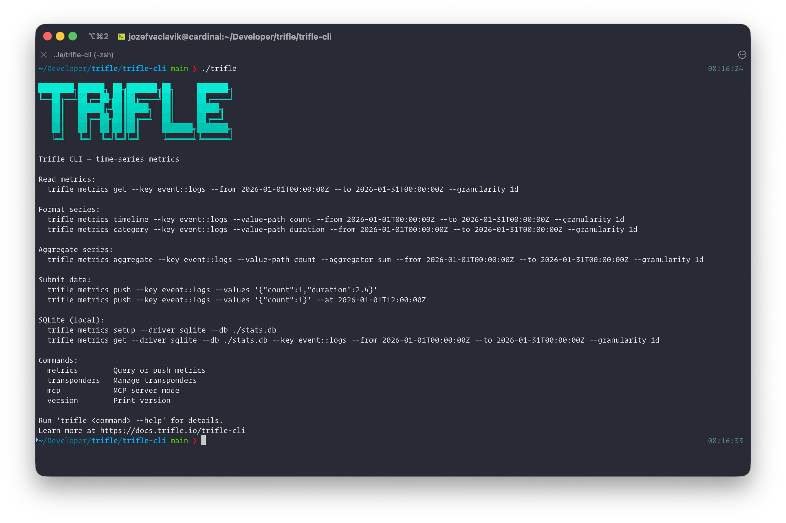

# Trifle CLI

Trifle CLI is a command-line interface for Trifle App and local SQLite metrics. It can query and push metrics via the Trifle API or a local SQLite database, and it ships an MCP server mode for AI agents.



## Install

- Download a release from GitHub and place `trifle` on your PATH.
- Or build locally (Go 1.22+):

```sh
go build -o trifle .
```

## Quick usage

Fetch series from the API:

```sh
trifle metrics get \
  --key event::signup \
  --from 2026-01-24T00:00:00Z \
  --to 2026-01-25T00:00:00Z \
  --granularity 1h
```

Use local SQLite:

```sh
trifle metrics setup --driver sqlite --db ./stats.db
trifle metrics push --driver sqlite --db ./stats.db --key event::signup --values '{"count":1}'
```

## Documentation

Learn more at https://docs.trifle.io/trifle-cli
